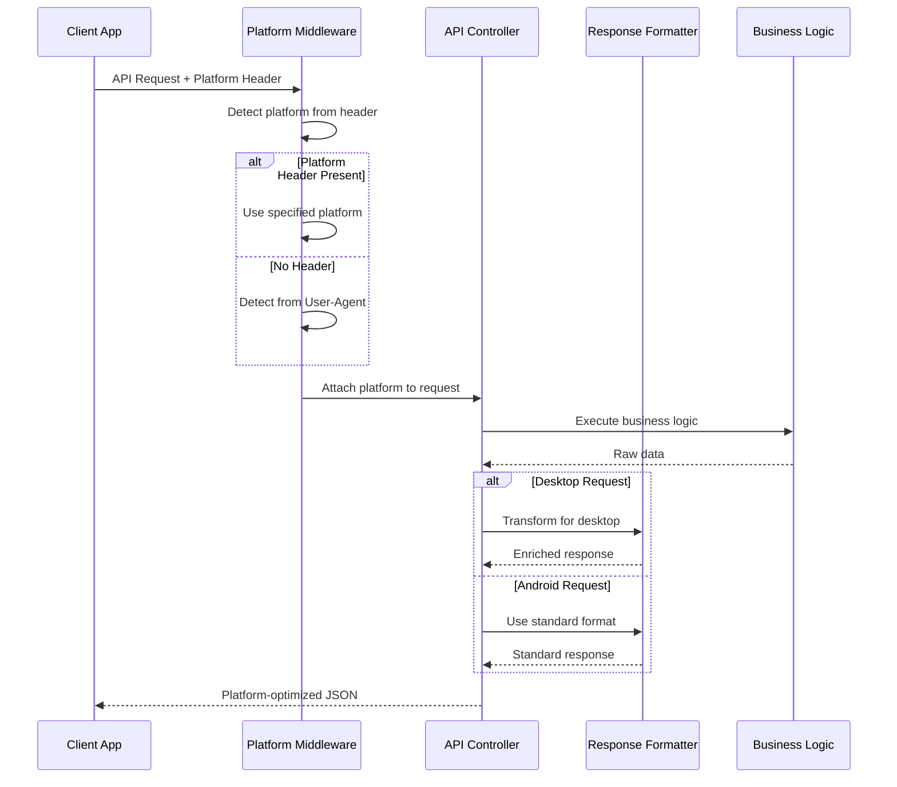
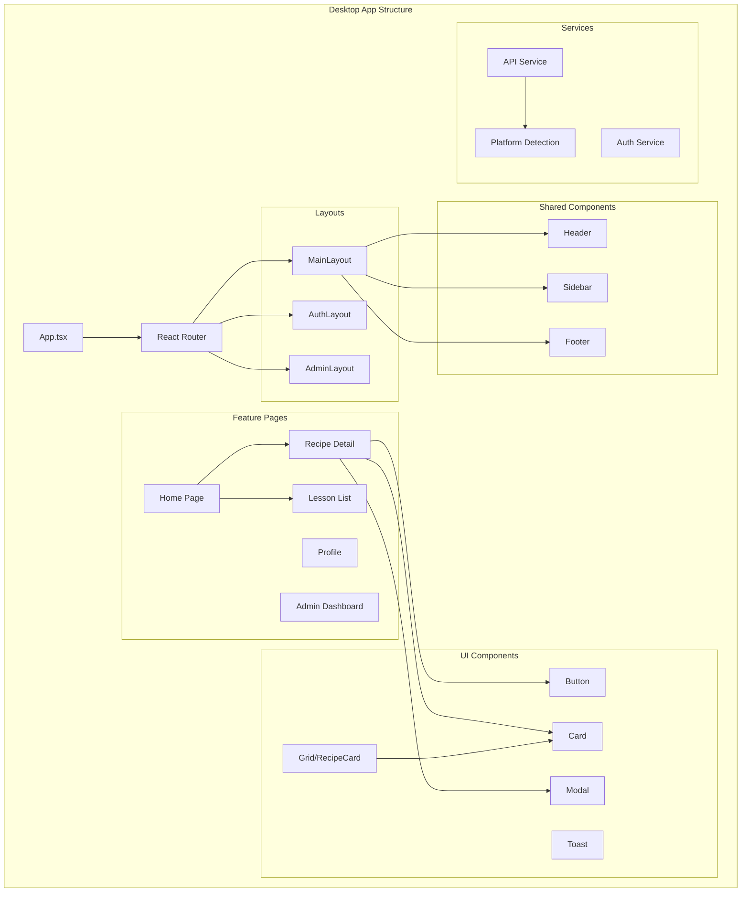

# Technical Design Document: Multi-Platform Layout for CookEdu

## Overview

This document outlines the technical design for adding a desktop/web layout to CookEdu while preserving the existing Android layout. The solution introduces platform-aware API responses and responsive frontend components that adapt to different device form factors. The desktop layout will follow Apple/Shopee/Tokopedia design principles: clean typography, generous whitespace, grid-based product displays, and smooth animations.

---

## Phase 1: High-Level Design

### 1.1 System Architecture

```mermaid
graph TB
    subgraph "Client Layer"
        Android[Android App]
        Desktop[Desktop/Web App]
        Tablet[Tablet App (Future)]
    end

    subgraph "API Layer"
        API[Laravel API]
        PlatformMiddleware[Platform Detection Middleware]
        ResponseFormatter[Response Formatter]
    end

    subgraph "Business Logic"
        Auth[Auth (Sanctum)]
        RecipeService[Recipe Service]
        LessonService[Lesson Service]
        ChefAI[ChefAI Service]
    end

    subgraph "Data Layer"
        DB[(PostgreSQL/SQLite)]
    end

    Android --> API
    Desktop --> API
    Tablet --> API

    API --> PlatformMiddleware
    PlatformMiddleware --> ResponseFormatter
    ResponseFormatter --> Auth
    ResponseFormatter --> RecipeService
    ResponseFormatter --> LessonService
    ResponseFormatter --> ChefAI

    Auth --> DB
    RecipeService --> DB
    LessonService --> DB
    ChefAI --> DB
```

### 1.2 Component Overview

| Component | Responsibility | Location |
|-----------|---------------|----------|
| Platform Detection Middleware | Detect client platform from User-Agent/Header | `backend/app/Http/Middleware/DetectPlatform.php` |
| Response Formatter | Transform API responses based on platform | `backend/app/Http/Resources/Platform/` |
| Desktop Web App | Responsive React/Vue frontend | `frontend-desktop/` |
| Android App | Existing native Android app | (unchanged) |
| Component Library | Shared UI components with platform variants | `frontend-desktop/src/components/` |

### 1.3 Data Models

```pascal
STRUCTURE PlatformConfig
  platform: Enum["android", "desktop", "tablet"]
  layout_version: String
  features: Array<String>
  response_fields: Array<String>
END STRUCTURE

STRUCTURE RecipeViewModel
  id: Integer
  title: String
  slug: String
  description: String
  image_url: String
  difficulty: String
  cooking_time: Integer
  category: CategoryViewModel
  creator: UserViewModel
  nutritional_info: Object
  is_system: Boolean
  created_at: DateTime
  -- Desktop-only fields
  rating: Float
  review_count: Integer
  is_bookmarked: Boolean
  is_favorited: Boolean
END STRUCTURE

STRUCTURE LessonViewModel
  id: Integer
  title: String
  slug: String
  video_url: String
  thumbnail: String
  content: String
  summary: String
  duration: Integer
  level: String
  category: CategoryViewModel
  is_published: Boolean
  prerequisite: LessonViewModel (nullable)
  -- Desktop-only fields
  progress: LessonProgress
  is_completed: Boolean
  related_lessons: Array<LessonViewModel>
END STRUCTURE
```

### 1.4 API Response Flow



---

## Phase 2: Low-Level Design

### 2.1 Platform Detection Strategy

**Recommended Approach**: Header-based detection with User-Agent fallback

#### Option A: Custom Header (Recommended)
```
X-Platform: desktop | android | tablet
X-Platform-Version: 1.0.0
Accept: application/vnd.cookedup.v1+json
```

#### Option B: User-Agent Fallback
- Android: Contains "Android" + "Mobile" or "Tablet"
- Tablet: Contains "iPad" or "Android" + "Tablet"
- Desktop: All other requests

**Decision**: Use Option A with Option B as fallback. This gives clients explicit control while maintaining backward compatibility.

### 2.2 Backend Implementation

#### Platform Detection Middleware

```php
// backend/app/Http/Middleware/DetectPlatform.php

namespace App\Http\Middleware;

use Closure;
use Illuminate\Http\Request;
use Symfony\Component\HttpFoundation\Response;

class DetectPlatform
{
    public function handle(Request $request, Closure $next): Response
    {
        // Priority 1: Explicit header
        $platform = $request->header('X-Platform', 'android');
        
        // Priority 2: Fallback to User-Agent detection
        if (!$request->hasHeader('X-Platform')) {
            $platform = $this->detectFromUserAgent($request->userAgent());
        }
        
        // Validate platform
        $allowed = ['android', 'desktop', 'tablet'];
        if (!in_array($platform, $allowed)) {
            $platform = 'android'; // Default fallback
        }
        
        // Attach to request for downstream use
        $request->attributes->set('platform', $platform);
        
        return $next($request);
    }
    
    private function detectFromUserAgent(?string $userAgent): string
    {
        if (!$userAgent) {
            return 'desktop'; // Web default
        }
        
        $ua = strtolower($userAgent);
        
        // Android detection
        if (str_contains($ua, 'android') && !str_contains($ua, 'mobile') === false) {
            return 'android';
        }
        
        // Tablet detection
        if (str_contains($ua, 'ipad') || 
            (str_contains($ua, 'android') && str_contains($ua, 'tablet'))) {
            return 'tablet';
        }
        
        // Desktop defaults
        return 'desktop';
    }
}
```

#### Platform-Aware Response Formatter

```php
// backend/app/Http/Resources/Platform/DesktopRecipeResource.php

namespace App\Http\Resources\Platform;

use Illuminate\Http\Request;
use App\Http\Resources\RecipeResource;

class DesktopRecipeResource extends RecipeResource
{
    protected array $additionalData = [];
    
    public function __construct($resource, array $additionalData = [])
    {
        parent::__construct($resource);
        $this->additionalData = $additionalData;
    }
    
    public function toArray(Request $request): array
    {
        $data = parent::toArray($request);
        
        // Add desktop-specific fields
        $data['rating'] = $this->calculateRating();
        $data['review_count'] = $this->calculateReviewCount();
        $data['is_bookmarked'] = $this->isBookmarkedBy($request->user()?->id);
        $data['is_favorited'] = $this->isFavoritedBy($request->user()?->id);
        
        // Add formatted display fields for desktop
        $data['display'] = [
            'formatted_cooking_time' => $this->formatCookingTime(),
            'difficulty_label' => $this->getDifficultyLabel(),
            'calories_per_serving' => $this->calculateCaloriesPerServing(),
        ];
        
        return $data;
    }
    
    private function calculateRating(): float
    {
        // Placeholder for rating calculation
        return round($this->resource->reviews()->avg('rating') ?? 0, 1);
    }
    
    private function calculateReviewCount(): int
    {
        return $this->resource->reviews()->count() ?? 0;
    }
    
    private function isBookmarkedBy(?int $userId): bool
    {
        if (!$userId) return false;
        return \DB::table('user_bookmarks')
            ->where('user_id', $userId)
            ->where('recipe_id', $this->resource->id)
            ->exists();
    }
    
    private function isFavoritedBy(?int $userId): bool
    {
        if (!$userId) return false;
        return \DB::table('user_favorites')
            ->where('user_id', $userId)
            ->where('recipe_id', $this->resource->id)
            ->exists();
    }
    
    private function formatCookingTime(): string
    {
        $minutes = $this->resource->cooking_time;
        if ($minutes < 60) {
            return "{$minutes} menit";
        }
        $hours = floor($minutes / 60);
        $mins = $minutes % 60;
        return $mins > 0 ? "{$hours} jam {$mins} menit" : "{$hours} jam";
    }
    
    private function getDifficultyLabel(): string
    {
        return match($this->resource->difficulty) {
            'easy' => 'Mudah',
            'medium' => 'Sedang',
            'hard' => 'Sulit',
            default => 'Tidak Diketahui'
        };
    }
    
    private function calculateCaloriesPerServing(): int
    {
        $nutrition = $this->resource->nutritional_info ?? [];
        $servings = $this->resource->servings ?? 1;
        return isset($nutrition['calories']) 
            ? (int) round($nutrition['calories'] / max($servings, 1))
            : 0;
    }
}
```

#### Updated Recipe Controller with Platform Support

```php
// backend/app/Http/Controllers/Api/RecipeController.php (updated methods)

namespace App\Http\Controllers\Api;

use App\Http\Controllers\Controller;
use App\Http\Requests\StoreRecipeRequest;
use App\Http\Requests\UpdateRecipeRequest;
use App\Http\Resources\RecipeResource;
use App\Http\Resources\Platform\DesktopRecipeResource;
use App\Models\Recipe;
use Illuminate\Http\Request;
use Illuminate\Support\Str;

class RecipeController extends Controller
{
    /**
     * List recipes with filters and search - platform-aware.
     */
    public function index(Request $request)
    {
        $query = Recipe::with(['category', 'creator'])
            ->where('moderation_status', 'approved');

        // Apply existing filters...
        if ($search = $request->query('search')) {
            $query->where(function ($q) use ($search) {
                $q->where('title', 'ILIKE', "%{$search}%")
                  ->orWhere('description', 'ILIKE', "%{$search}%");
            });
        }
        
        // ... (other existing filters)

        $recipes = $query->paginate($request->query('per_page', 12));
        
        // Detect platform from request attributes
        $platform = $request->attributes->get('platform', 'android');
        
        // Transform based on platform
        if ($platform === 'desktop') {
            return DesktopRecipeResource::collection($recipes);
        }
        
        return RecipeResource::collection($recipes);
    }

    /**
     * Show a single recipe - platform-aware.
     */
    public function show(Request $request, Recipe $recipe)
    {
        $recipe->load(['category', 'creator']);
        
        $platform = $request->attributes->get('platform', 'android');
        
        if ($platform === 'desktop') {
            return response()->json([
                'data' => new DesktopRecipeResource($recipe),
                'meta' => [
                    'platform' => 'desktop',
                    'layout' => 'grid', // Desktop optimized for grid display
                ]
            ]);
        }
        
        return response()->json([
            'data' => new RecipeResource($recipe),
        ]);
    }
}
```

### 2.3 Desktop Frontend Architecture

#### Technology Stack Recommendation
- **Framework**: React 18+ or Vue 3+ (TypeScript)
- **Routing**: React Router v6 / Vue Router 4
- **State Management**: Zustand / Pinia
- **HTTP Client**: Axios with interceptors
- **Styling**: Tailwind CSS with custom design tokens

#### Component Architecture



#### Responsive Grid System

```typescript
// frontend-desktop/src/components/layout/RecipeGrid.tsx

interface RecipeGridProps {
  recipes: Recipe[];
  viewMode?: 'grid' | 'list';
  columns?: {
    mobile: number;
    tablet: number;
    desktop: number;
    wide: number;
  };
}

export const RecipeGrid: React.FC<RecipeGridProps> = ({
  recipes,
  viewMode = 'grid',
  columns = { mobile: 1, tablet: 2, desktop: 3, wide: 4 }
}) => {
  return (
    <div className={`
      grid 
      grid-cols-${columns.mobile}
      sm:grid-cols-${columns.tablet}
      lg:grid-cols-${columns.desktop}
      xl:grid-cols-${columns.wide}
      gap-4 md:gap-6
    `}>
      {recipes.map(recipe => (
        <RecipeCard 
          key={recipe.id} 
          recipe={recipe}
          variant={viewMode}
        />
      ))}
    </div>
  );
};
```

#### Apple/Shopee/Tokopedia Style Design Tokens

```typescript
// frontend-desktop/src/styles/tokens.css

:root {
  /* Colors - Clean, modern palette */
  --color-primary: #007AFF;        /* iOS Blue */
  --color-primary-hover: #0056CC;
  --color-secondary: #FF9500;      /* Shopee Orange warmth */
  --color-accent: #34C759;         /* Success/Shopee Green */
  --color-error: #FF3B30;          /* iOS Red */
  --color-warning: #FF9500;        /* iOS Orange */
  
  /* Neutrals - Tokopedia/Shopee style grays */
  --color-bg-primary: #FFFFFF;
  --color-bg-secondary: #F5F5F5;
  --color-bg-tertiary: #EEEEEE;
  --color-text-primary: #212121;
  --color-text-secondary: #757575;
  --color-text-tertiary: #9E9E9E;
  --color-border: #E0E0E0;
  
  /* Typography */
  --font-family: -apple-system, BlinkMacSystemFont, 'Segoe UI', Roboto, sans-serif;
  --font-size-xs: 0.75rem;    /* 12px */
  --font-size-sm: 0.875rem;   /* 14px */
  --font-size-base: 1rem;     /* 16px */
  --font-size-lg: 1.125rem;   /* 18px */
  --font-size-xl: 1.25rem;    /* 20px */
  --font-size-2xl: 1.5rem;    /* 24px */
  --font-size-3xl: 1.875rem;  /* 30px */
  --font-size-4xl: 2.25rem;   /* 36px */
  
  /* Spacing - Generous whitespace like Apple */
  --space-1: 0.25rem;   /* 4px */
  --space-2: 0.5rem;    /* 8px */
  --space-3: 0.75rem;   /* 12px */
  --space-4: 1rem;      /* 16px */
  --space-5: 1.25rem;   /* 20px */
  --space-6: 1.5rem;    /* 24px */
  --space-8: 2rem;      /* 32px */
  --space-10: 2.5rem;   /* 40px */
  --space-12: 3rem;     /* 48px */
  
  /* Shadows - Subtle, layered like iOS */
  --shadow-sm: 0 1px 2px rgba(0, 0, 0, 0.05);
  --shadow-md: 0 4px 6px -1px rgba(0, 0, 0, 0.1);
  --shadow-lg: 0 10px 15px -3px rgba(0, 0, 0, 0.1);
  --shadow-xl: 0 20px 25px -5px rgba(0, 0, 0, 0.1);
  
  /* Border Radius - Rounded, friendly */
  --radius-sm: 0.375rem;   /* 6px */
  --radius-md: 0.5rem;     /* 8px */
  --radius-lg: 0.75rem;    /* 12px */
  --radius-xl: 1rem;       /* 16px */
  --radius-full: 9999px;
  
  /* Transitions - Smooth, like iOS */
  --transition-fast: 150ms ease;
  --transition-base: 250ms ease;
  --transition-slow: 350ms ease;
  
  /* Container */
  --container-max: 1280px;
  --container-padding: 1.5rem;
}
```

### 2.4 API Changes Summary

| Endpoint | Change Type | Description |
|----------|-------------|-------------|
| `GET /api/recipes` | Modified | Platform-aware response transformation |
| `GET /api/recipes/{id}` | Modified | Add desktop-specific fields |
| `GET /api/lessons` | Modified | Platform-aware response transformation |
| `GET /api/lessons/{id}` | Modified | Add progress data for desktop |
| `GET /api/categories` | No change | Already minimal |
| `GET /api/dashboard` | Modified | Add desktop-specific stats |
| `POST /api/auth/*` | No change | Auth already platform-agnostic |

### 2.5 New Backend Components

| File | Purpose |
|------|---------|
| `app/Http/Middleware/DetectPlatform.php` | Platform detection |
| `app/Http/Resources/Platform/DesktopRecipeResource.php` | Desktop recipe formatting |
| `app/Http/Resources/Platform/DesktopLessonResource.php` | Desktop lesson formatting |
| `app/Http/Resources/Platform/DesktopUserResource.php` | Desktop user formatting |
| `config/platform.php` | Platform configuration |
| `database/migrations/*_create_bookmarks_and_favorites_tables.php` | Optional bookmark/favorite tables |

### 2.6 Tablet Support (Future)

The platform detection middleware supports tablet detection. For future tablet optimization:

```typescript
// frontend-desktop/src/hooks/useResponsive.ts

export const useBreakpoint = () => {
  const [breakpoint, setBreakpoint] = useState<'mobile' | 'tablet' | 'desktop' | 'wide'>('desktop');
  
  useEffect(() => {
    const updateBreakpoint = () => {
      const width = window.innerWidth;
      if (width < 768) setBreakpoint('mobile');
      else if (width < 1024) setBreakpoint('tablet');
      else if (width < 1440) setBreakpoint('desktop');
      else setBreakpoint('wide');
    };
    
    updateBreakpoint();
    window.addEventListener('resize', updateBreakpoint);
    return () => window.removeEventListener('resize', updateBreakpoint);
  }, []);
  
  return breakpoint;
};
```

### 2.7 Error Handling

```pascal
PROCEDURE handlePlatformError(response, platform)
  IF platform = "desktop" THEN
    -- Desktop: Show user-friendly toast + redirect suggestions
    DISPLAY toast.error(response.message)
    IF response.recovery_action EXISTS THEN
      SUGGEST redirect_to(response.recovery_action)
    END IF
  ELSE
    -- Android: Use existing error handling
    DISPLAY existing.android.error.dialog(response)
  END IF
END PROCEDURE
```

---

## Phase 3: Implementation Phases

### Phase 1: Backend (Week 1-2)
1. Create platform detection middleware
2. Create desktop response resources
3. Update existing controllers for platform awareness
4. Add platform configuration
5. Write unit tests

### Phase 2: Desktop Frontend - Core (Week 3-4)
1. Set up project structure
2. Implement API service with platform headers
3. Create layout components (Header, Sidebar, Footer)
4. Build responsive grid system
5. Implement routing

### Phase 3: Desktop Frontend - Features (Week 5-6)
1. Home page with recipe grid
2. Recipe detail page
3. Lesson list and detail pages
4. User profile page
5. Authentication flow

### Phase 4: Polish & Testing (Week 7)
1. Responsive testing across devices
2. Performance optimization
3. Accessibility audit
4. Production deployment

---

## Phase 4: Testing Strategy

### Unit Tests (Backend)

```php
// tests/Unit/PlatformDetectionTest.php

it('detects android platform from header', function () {
    $response = $this->getJson('/api/recipes', [
        'X-Platform' => 'android'
    ]);
    
    $response->assertStatus(200);
});

it('detects desktop platform from header', function () {
    $response = $this->getJson('/api/recipes', [
        'X-Platform' => 'desktop'
    ]);
    
    $response->assertStatus(200);
    $response->assertJsonStructure([
        'data' => [
            '*' => ['rating', 'review_count', 'is_bookmarked']
        ]
    ]);
});

it('falls back to desktop from user agent', function () {
    $response = $this->getJson('/api/recipes', [
        'User-Agent' => 'Mozilla/5.0 (Macintosh; Intel Mac OS X 10_15_7)'
    ]);
    
    $response->assertStatus(200);
});
```

### Frontend Testing
- **Unit**: Jest + React Testing Library for components
- **E2E**: Playwright for critical user flows
- **Visual Regression**: Chromatic for design consistency

---

## Phase 5: Security Considerations

1. **Platform Header Validation**: Validate against allowed values, reject invalid
2. **CORS Configuration**: Allow desktop frontend domain
3. **Rate Limiting**: Apply per-platform rate limits if needed
4. **Authentication**: Laravel Sanctum handles both platforms
5. **CSRF**: Desktop uses same Sanctum token-based auth

---

## Phase 6: Dependencies

### Backend (New)
- None (existing Laravel 11 already has needed packages)

### Desktop Frontend (Recommended)
```json
{
  "dependencies": {
    "react": "^18.2.0",
    "react-router-dom": "^6.x",
    "zustand": "^4.x",
    "axios": "^1.x",
    "tailwindcss": "^3.x",
    "lucide-react": "^0.x",
    "framer-motion": "^10.x"
  }
}
```

---

## Summary

This design enables CookEdu to serve both Android and desktop platforms from a single backend API while providing optimized experiences for each. The key decisions are:

1. **Header-based platform detection** with User-Agent fallback
2. **Resource transformation** at the API layer for platform-specific responses
3. **Responsive CSS grid** for desktop layout (Apple/Shopee/Tokopedia style)
4. **Modular component architecture** for maintainability
5. **Future tablet support** built into the platform detection system
---

## Architecture

The multi-platform CookEdu application follows a client-server architecture with platform-aware API responses.

### System Architecture

```mermaid
graph TB
    subgraph "Client Layer"
        Android[Android App]
        Desktop[Desktop/Web App]
        Tablet[Tablet App (Future)]
    end

    subgraph "API Layer"
        API[Laravel API]
        PlatformMiddleware[Platform Detection Middleware]
        ResponseFormatter[Response Formatter]
    end

    subgraph "Business Logic"
        Auth[Auth (Sanctum)]
        RecipeService[Recipe Service]
        LessonService[Lesson Service]
        ChefAI[ChefAI Service]
    end

    subgraph "Data Layer"
        DB[(PostgreSQL/SQLite)]
    end

    Android --> API
    Desktop --> API
    Tablet --> API

    API --> PlatformMiddleware
    PlatformMiddleware --> ResponseFormatter
    ResponseFormatter --> Auth
    ResponseFormatter --> RecipeService
    ResponseFormatter --> LessonService
    ResponseFormatter --> ChefAI

    Auth --> DB
    RecipeService --> DB
    LessonService --> DB
    ChefAI --> DB
```

### Key Architectural Decisions

1. **Header-based platform detection** with User-Agent fallback for backward compatibility
2. **Resource transformation** at the API layer for platform-specific responses
3. **Single backend** serving both Android and desktop platforms
4. **Responsive CSS grid** for desktop layout with Apple/Shopee/Tokopedia style design

---

## Components and Interfaces

### Backend Components

| Component | Responsibility | Location |
|-----------|---------------|----------|
| Platform Detection Middleware | Detect client platform from User-Agent/Header | `backend/app/Http/Middleware/DetectPlatform.php` |
| DesktopRecipeResource | Transform recipe responses for desktop | `backend/app/Http/Resources/Platform/DesktopRecipeResource.php` |
| DesktopLessonResource | Transform lesson responses for desktop | `backend/app/Http/Resources/Platform/DesktopLessonResource.php` |
| DesktopUserResource | Transform user responses for desktop | `backend/app/Http/Resources/Platform/DesktopUserResource.php` |
| RecipeController | Handle recipe CRUD with platform awareness | `backend/app/Http/Controllers/Api/RecipeController.php` |
| LessonController | Handle lesson CRUD with platform awareness | `backend/app/Http/Controllers/Api/LessonController.php` |

### Desktop Frontend Components

| Component | Responsibility |
|-----------|---------------|
| App.tsx | Root application component |
| MainLayout | Main layout with header, sidebar, footer |
| AuthLayout | Layout for authentication pages |
| AdminLayout | Layout for admin dashboard |
| RecipeGrid | Responsive grid for recipe display |
| RecipeCard | Card component for individual recipes |
| Header | Site header with navigation |
| Sidebar | Navigation sidebar |
| API Service | HTTP client with platform headers |
| Auth Service | Authentication handling |

### Interface Definitions

```typescript
interface RecipeViewModel {
  id: number;
  title: string;
  slug: string;
  description: string;
  image_url: string;
  difficulty: string;
  cooking_time: number;
  category: CategoryViewModel;
  creator: UserViewModel;
  nutritional_info: object;
  is_system: boolean;
  created_at: string;
  // Desktop-only fields
  rating?: number;
  review_count?: number;
  is_bookmarked?: boolean;
  is_favorited?: boolean;
}

interface PlatformConfig {
  platform: 'android' | 'desktop' | 'tablet';
  layout_version: string;
  features: string[];
  response_fields: string[];
}

interface APIResponse<T> {
  data: T;
  meta?: {
    platform: string;
    layout: string;
  };
}
```

---

## Data Models

### Core Data Models

```pascal
STRUCTURE PlatformConfig
  platform: Enum["android", "desktop", "tablet"]
  layout_version: String
  features: Array<String>
  response_fields: Array<String>
END STRUCTURE

STRUCTURE RecipeViewModel
  id: Integer
  title: String
  slug: String
  description: String
  image_url: String
  difficulty: String
  cooking_time: Integer
  category: CategoryViewModel
  creator: UserViewModel
  nutritional_info: Object
  is_system: Boolean
  created_at: DateTime
  -- Desktop-only fields
  rating: Float
  review_count: Integer
  is_bookmarked: Boolean
  is_favorited: Boolean
END STRUCTURE

STRUCTURE LessonViewModel
  id: Integer
  title: String
  slug: String
  video_url: String
  thumbnail: String
  content: String
  summary: String
  duration: Integer
  level: String
  category: CategoryViewModel
  is_published: Boolean
  prerequisite: LessonViewModel (nullable)
  -- Desktop-only fields
  progress: LessonProgress
  is_completed: Boolean
  related_lessons: Array<LessonViewModel>
END STRUCTURE

STRUCTURE CategoryViewModel
  id: Integer
  name: String
  slug: String
  icon: String
  recipe_count: Integer
END STRUCTURE

STRUCTURE UserViewModel
  id: Integer
  name: String
  email: String
  avatar_url: String
  role: String
  created_at: DateTime
END STRUCTURE

STRUCTURE AuthResult
  VARIANT Success(token: Token, user: UserViewModel)
  VARIANT Error(message: String)
END STRUCTURE
```

### Validation Rules

- **RecipeViewModel.title**: Required, max 255 characters
- **RecipeViewModel.cooking_time**: Required, positive integer (minutes)
- **RecipeViewModel.difficulty**: Required, must be "easy", "medium", or "hard"
- **PlatformConfig.platform**: Required, must be "android", "desktop", or "tablet"

---

## Correctness Properties

### Property 1: detectPlatformReturnsValidPlatform

```pascal
PROPERTY detectPlatformReturnsValidPlatform
  FOR ALL request IN HTTPRequest:
    LET platform = detectPlatform(request)
    ASSERT platform IN {"android", "desktop", "tablet"}
END PROPERTY
```

**Validates: Requirements 1.1, 1.5**

### Property 2: headerTakesPriorityOverUserAgent

```pascal
PROPERTY headerTakesPriorityOverUserAgent
  FOR ALL request IN HTTPRequest:
    IF request.header["X-Platform"] EXISTS THEN
      ASSERT detectPlatform(request) = request.header["X-Platform"]
    END IF
END PROPERTY
```

**Validates: Requirements 1.1, 1.2**

### Property 3: desktopResponseContainsDesktopFields

```pascal
PROPERTY desktopResponseContainsDesktopFields
  FOR ALL recipe IN Recipe:
    LET response = transformForDesktop(recipe)
    ASSERT response.rating EXISTS
    ASSERT response.review_count EXISTS
    ASSERT response.is_bookmarked EXISTS
    ASSERT response.is_favorited EXISTS
END PROPERTY
```

**Validates: Requirements 2.1, 2.3**

### Property 4: androidResponseExcludesDesktopFields

```pascal
PROPERTY androidResponseExcludesDesktopFields
  FOR ALL recipe IN Recipe:
    LET response = transformForAndroid(recipe)
    ASSERT response.rating DOES NOT EXIST
    ASSERT response.review_count DOES NOT EXIST
END PROPERTY
```

**Validates: Requirements 2.2**

### Property 5: authenticatedRequestContainsUser

```pascal
PROPERTY authenticatedRequestContainsUser
  FOR ALL request IN AuthenticatedRequest:
    LET user = getCurrentUser(request)
    ASSERT user IS NOT NULL
END PROPERTY
```

**Validates: Requirements 9.2**

### Property 6: platformHeaderPreservedInAuth

```pascal
PROPERTY platformHeaderPreservedInAuth
  FOR ALL request IN AuthenticatedRequest:
    ASSERT request.attributes["platform"] = request.header["X-Platform"]
END PROPERTY
```

**Validates: Requirements 1.4**

---

## Error Handling

### Error Scenarios

#### Scenario 1: Invalid Platform Header

**Condition**: Client sends invalid value in `X-Platform` header (not "android", "desktop", or "tablet")

**Response**: 
- Backend defaults to "android" platform
- Request continues normally with default platform

**Recovery**: Client should send valid platform header values

#### Scenario 2: Missing Required Fields

**Condition**: API request missing required fields for recipe/lesson creation

**Response**:
- HTTP 422 Unprocessable Entity
- JSON response with validation error details

```json
{
  "message": "The given data was invalid.",
  "errors": {
    "title": ["The title field is required."],
    "cooking_time": ["The cooking time field is required."]
  }
}
```

**Recovery**: Client should validate fields before sending request

#### Scenario 3: Platform Detection Failure

**Condition**: Both `X-Platform` header missing and User-Agent empty/invalid

**Response**:
- Backend defaults to "desktop" platform (web default)
- Request continues with desktop platform

**Recovery**: Clients should always send `X-Platform` header for explicit platform specification

#### Scenario 4: Desktop-Specific Feature Unavailable

**Condition**: Desktop client requests feature only available on Android

**Response**:
- HTTP 400 Bad Request with descriptive message
- Include `recovery_action` hint for redirect

```json
{
  "message": "This feature is not available on desktop",
  "recovery_action": "Use the mobile app for this feature"
}
```

**Recovery**: Desktop client should hide/disable features not available on desktop

#### Scenario 5: Network Error

**Condition**: Network connectivity issues between client and server

**Response**:
- Desktop: Show user-friendly toast notification with retry option
- Android: Use existing error handling (snackbar/dialog)

**Recovery**: Client should implement retry logic with exponential backoff

### Error Handling Implementation

```pascal
PROCEDURE handlePlatformError(response, platform)
  IF platform = "desktop" THEN
    -- Desktop: Show user-friendly toast + redirect suggestions
    DISPLAY toast.error(response.message)
    IF response.recovery_action EXISTS THEN
      SUGGEST redirect_to(response.recovery_action)
    END IF
  ELSE
    -- Android: Use existing error handling
    DISPLAY existing.android.error.dialog(response)
  END IF
END PROCEDURE
```

---

## Testing Strategy

### Unit Tests (Backend)

```php
// tests/Unit/PlatformDetectionTest.php

it('detects android platform from header', function () {
    $response = $this->getJson('/api/recipes', [
        'X-Platform' => 'android'
    ]);
    
    $response->assertStatus(200);
});

it('detects desktop platform from header', function () {
    $response = $this->getJson('/api/recipes', [
        'X-Platform' => 'desktop'
    ]);
    
    $response->assertStatus(200);
    $response->assertJsonStructure([
        'data' => [
            '*' => ['rating', 'review_count', 'is_bookmarked']
        ]
    ]);
});

it('falls back to desktop from user agent', function () {
    $response = $this->getJson('/api/recipes', [
        'User-Agent' => 'Mozilla/5.0 (Macintosh; Intel Mac OS X 10_15_7)'
    ]);
    
    $response->assertStatus(200);
});

it('defaults to android for invalid platform header', function () {
    $response = $this->getJson('/api/recipes', [
        'X-Platform' => 'invalid-platform'
    ]);
    
    $response->assertStatus(200);
});

it('transforms recipe response for desktop', function () {
    $recipe = Recipe::factory()->create();
    
    $response = $this->getJson('/api/recipes/' . $recipe->id, [
        'X-Platform' => 'desktop'
    ]);
    
    $response->assertJsonStructure([
        'data' => [
            'rating',
            'review_count',
            'is_bookmarked',
            'is_favorited',
            'display' => [
                'formatted_cooking_time',
                'difficulty_label'
            ]
        ]
    ]);
});
```

### Frontend Testing

#### Unit Tests
- **Framework**: Jest + React Testing Library
- **Coverage Target**: 80% code coverage
- **Key Test Cases**:
  - RecipeGrid responsive column calculations
  - Platform header injection in API service
  - Error toast display logic

#### Component Tests

```typescript
// frontend-desktop/src/components/__tests__/RecipeGrid.test.tsx

describe('RecipeGrid', () => {
  it('renders correct number of columns at desktop breakpoint', () => {
    render(<RecipeGrid recipes={mockRecipes} />);
    
    const grid = screen.getByRole('grid');
    expect(grid).toHaveClass('lg:grid-cols-3');
  });
  
  it('displays all recipe cards', () => {
    render(<RecipeGrid recipes={mockRecipes} />);
    
    mockRecipes.forEach(recipe => {
      expect(screen.getByText(recipe.title)).toBeInTheDocument();
    });
  });
});
```

#### Integration Tests

```typescript
// frontend-desktop/src/__tests__/RecipeFlow.test.ts

describe('Recipe Flow', () => {
  it('loads and displays recipes on home page', async () => {
    render(<App />);
    
    await waitFor(() => {
      expect(screen.getByText('Resep Terbaru')).toBeInTheDocument();
    });
    
    const recipes = await screen.findAllByRole('article');
    expect(recipes.length).toBeGreaterThan(0);
  });
});
```

### End-to-End Tests

- **Framework**: Playwright
- **Browser Coverage**: Chrome, Firefox, Safari

#### Critical User Flows
1. User browses recipes on desktop
2. User views recipe detail
3. User authenticates (login/logout)
4. User searches for recipes

### Visual Regression Testing

- **Tool**: Chromatic
- **Trigger**: Every PR and merge to main
- **Components Tracked**: All UI components
- **Acceptance Criteria**: No visual regressions detected

### Performance Testing

- **Metrics**:
  - First Contentful Paint (FCP) < 1.5s
  - Largest Contentful Paint (LCP) < 2.5s
  - Time to Interactive (TTI) < 3.5s
- **Tools**: Lighthouse, WebPageTest