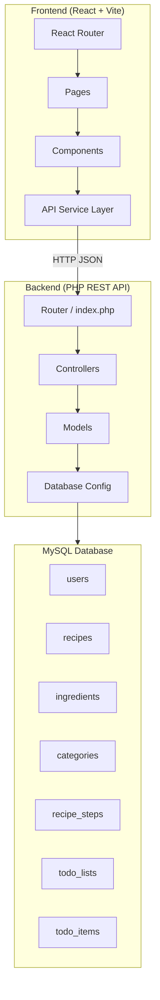
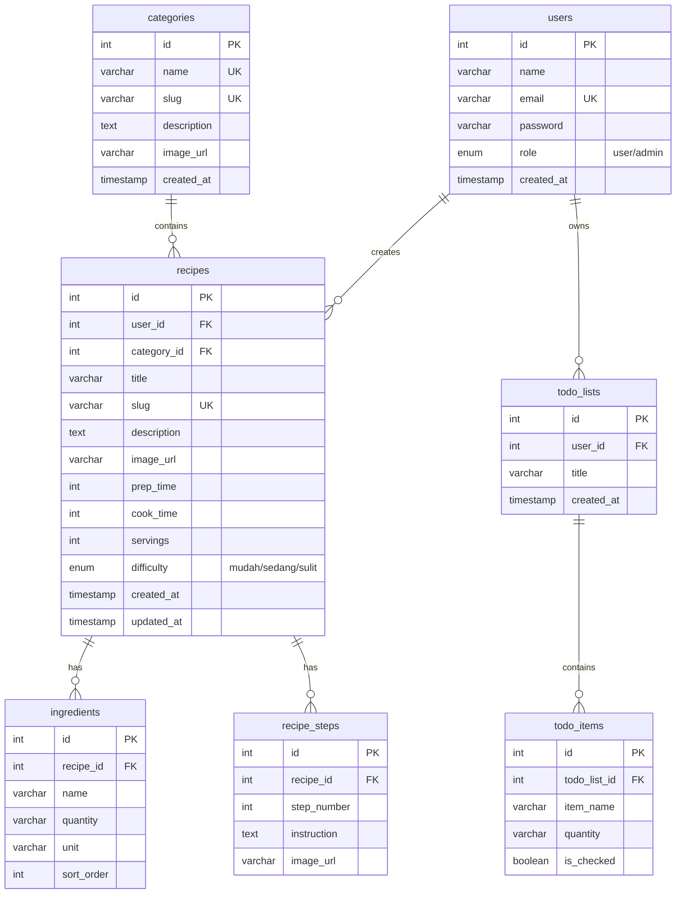

# Cooking Tutorial Platform — Implementation Plan

Platform tutorial memasak full-stack dengan React frontend, PHP REST API backend, dan MySQL database.

## Arsitektur Tingkat Tinggi



---

## Struktur Folder Project

```
d:\coding\Tutorial-Masak\
├── frontend/                          # React + Vite app
│   ├── public/
│   │   └── favicon.ico
│   ├── src/
│   │   ├── assets/                    # Gambar, font
│   │   ├── components/
│   │   │   ├── layout/
│   │   │   │   ├── Navbar.jsx
│   │   │   │   ├── Footer.jsx
│   │   │   │   ├── AdminSidebar.jsx
│   │   │   │   └── AdminTopBar.jsx
│   │   │   ├── recipe/
│   │   │   │   ├── RecipeCard.jsx
│   │   │   │   ├── IngredientChecklist.jsx
│   │   │   │   └── StepList.jsx
│   │   │   ├── admin/
│   │   │   │   ├── StatsCard.jsx
│   │   │   │   ├── DataTable.jsx
│   │   │   │   └── RecipeForm.jsx
│   │   │   └── ui/
│   │   │       ├── Button.jsx
│   │   │       ├── Input.jsx
│   │   │       ├── Modal.jsx
│   │   │       └── Badge.jsx
│   │   ├── pages/
│   │   │   ├── Home.jsx
│   │   │   ├── RecipeDetail.jsx
│   │   │   ├── RecipeList.jsx
│   │   │   ├── Login.jsx
│   │   │   ├── Register.jsx
│   │   │   ├── TodoList.jsx
│   │   │   └── admin/
│   │   │       ├── Dashboard.jsx
│   │   │       ├── ManageRecipes.jsx
│   │   │       └── ManageCategories.jsx
│   │   ├── services/
│   │   │   └── api.js                 # Axios instance + API calls
│   │   ├── context/
│   │   │   └── AuthContext.jsx        # Auth state management
│   │   ├── hooks/
│   │   │   └── useAuth.js
│   │   ├── App.jsx
│   │   ├── main.jsx
│   │   └── index.css                  # Tailwind + custom styles
│   ├── tailwind.config.js
│   ├── postcss.config.js
│   ├── vite.config.js
│   └── package.json
│
├── backend/                           # PHP REST API
│   ├── api/
│   │   ├── config/
│   │   │   └── database.php           # Koneksi PDO MySQL
│   │   ├── models/
│   │   │   ├── User.php
│   │   │   ├── Recipe.php
│   │   │   ├── Category.php
│   │   │   └── TodoList.php
│   │   ├── controllers/
│   │   │   ├── AuthController.php
│   │   │   ├── RecipeController.php
│   │   │   ├── CategoryController.php
│   │   │   └── TodoController.php
│   │   ├── middleware/
│   │   │   └── AuthMiddleware.php     # JWT verification
│   │   └── helpers/
│   │       └── Response.php           # JSON response helper
│   ├── .htaccess                      # URL rewriting
│   └── index.php                      # Entry point / router
│
├── database/
│   └── schema.sql                     # DDL lengkap
│
└── README.md
```

---

## Skema Database (MySQL DDL)



> [!NOTE]
> Relasi **one-to-many** antara `recipes ↔ ingredients` dan `recipes ↔ recipe_steps` memastikan data ternormalisasi — tidak ada JSON blob atau teks comma-separated.

---

## Proposed Changes

### 1. Database Schema (`database/schema.sql`)

#### [NEW] [schema.sql](file:///d:/coding/Tutorial-Masak/database/schema.sql)
- DDL lengkap untuk semua 7 tabel
- Foreign keys dengan `ON DELETE CASCADE`
- Index pada kolom yang sering di-query (`slug`, `email`, `category_id`)
- Seed data sample untuk demo

---

### 2. Backend PHP REST API

#### [NEW] [index.php](file:///d:/coding/Tutorial-Masak/backend/index.php)
- Entry point / simple router
- Routing berdasarkan `$_SERVER['REQUEST_URI']` dan `$_SERVER['REQUEST_METHOD']`
- CORS headers untuk development

#### [NEW] [.htaccess](file:///d:/coding/Tutorial-Masak/backend/.htaccess)
- URL rewriting agar semua request diarahkan ke `index.php`

#### [NEW] [database.php](file:///d:/coding/Tutorial-Masak/backend/api/config/database.php)
- Koneksi PDO MySQL dengan error handling
- Singleton pattern

#### [NEW] [Response.php](file:///d:/coding/Tutorial-Masak/backend/api/helpers/Response.php)
- Helper class untuk format JSON response yang konsisten
- Method: `success()`, `error()`, `paginated()`

#### [NEW] [AuthMiddleware.php](file:///d:/coding/Tutorial-Masak/backend/api/middleware/AuthMiddleware.php)
- JWT token verification menggunakan `firebase/php-jwt` atau manual HMAC
- Role-based access control (user vs admin)

#### [NEW] Model files
- `User.php` — CRUD + auth queries
- `Recipe.php` — CRUD + join ingredients/steps
- `Category.php` — CRUD
- `TodoList.php` — CRUD per user

#### [NEW] Controller files
- `AuthController.php` — login, register, logout, me
- `RecipeController.php` — index, show, store, update, delete
- `CategoryController.php` — index, store, update, delete
- `TodoController.php` — index, store, toggleItem, delete

---

### 3. Frontend React (Vite + Tailwind CSS)

#### Setup & Konfigurasi

- Vite project dengan React template
- Tailwind CSS v3 dengan custom color palette:
  - **Terracotta**: `#C4634F` (primary)
  - **Cream/Warm White**: `#FAF5F0` (background)
  - **Charcoal**: `#2D2D2D` (text)
  - **Sage Green**: `#8B9E82` (accent)
- Google Font: **Inter** (body) + **Playfair Display** (headings)
- Lucide React untuk iconography
- Framer Motion untuk page transitions & micro-animations

#### [NEW] UI Components (`src/components/ui/`)
- `Button.jsx` — variant-based (primary, secondary, ghost, danger)
- `Input.jsx` — styled form input dengan label & error state
- `Modal.jsx` — dialog overlay dengan Framer Motion
- `Badge.jsx` — status/difficulty badges

#### [NEW] Layout Components (`src/components/layout/`)
- `Navbar.jsx` — responsive navigation, auth state, mobile menu
- `Footer.jsx` — minimal footer
- `AdminSidebar.jsx` — fixed sidebar dengan navigation links + active state
- `AdminTopBar.jsx` — search bar, notification bell, profile dropdown

#### [NEW] Recipe Components (`src/components/recipe/`)
- `RecipeCard.jsx` — card dengan hover effect halus, badge difficulty
- `IngredientChecklist.jsx` — **interactive checklist** dengan React state, strikethrough animation saat item dicentang
- `StepList.jsx` — numbered steps dengan optional image

#### [NEW] Admin Components (`src/components/admin/`)
- `StatsCard.jsx` — card statistik dengan icon & trend indicator
- `DataTable.jsx` — sortable table dengan pagination, search, action buttons
- `RecipeForm.jsx` — form CRUD resep dengan dynamic ingredient/step fields

#### [NEW] Pages
- `Home.jsx` — hero section, featured recipes, categories showcase
- `RecipeList.jsx` — grid layout, filter by category, search
- `RecipeDetail.jsx` — full recipe view dengan IngredientChecklist + StepList
- `Login.jsx` & `Register.jsx` — auth forms, terpisah user/admin
- `TodoList.jsx` — shopping list management
- `admin/Dashboard.jsx` — stats cards + chart (menggunakan Recharts)
- `admin/ManageRecipes.jsx` — DataTable + CRUD modal
- `admin/ManageCategories.jsx` — DataTable + CRUD modal

#### [NEW] Services & Context
- `api.js` — Axios instance, interceptors untuk JWT, semua API endpoints
- `AuthContext.jsx` — React Context untuk auth state, login/logout/register functions
- `useAuth.js` — custom hook

---

## Desain UI/UX — Prinsip Kunci

| Aspek | Pendekatan |
|---|---|
| **Whitespace** | Generous padding/margin (Tailwind `p-8`, `gap-6`, `space-y-8`) |
| **Tipografi** | Inter untuk body, Playfair Display untuk heading resep |
| **Warna** | Warm palette: terracotta, cream, charcoal, sage green |
| **Shadow** | Minimal — hanya `shadow-sm` untuk card, tidak ada shadow besar |
| **Border** | Subtle `border border-stone-200` daripada shadow |
| **Hover** | `scale(1.02)` + subtle border color change, bukan shadow dramatis |
| **Animasi** | Framer Motion: `fadeIn`, `slideUp` untuk page transitions |
| **Admin Sidebar** | Fixed, 260px width, dark charcoal background |
| **Admin Layout** | Sidebar kiri + TopBar atas = SaaS-style professional layout |

---

## API Endpoints

| Method | Endpoint | Auth | Deskripsi |
|--------|----------|------|-----------|
| `POST` | `/api/auth/register` | — | Register user baru |
| `POST` | `/api/auth/login` | — | Login, return JWT |
| `GET` | `/api/auth/me` | User | Get current user |
| `GET` | `/api/recipes` | — | List semua resep (paginated) |
| `GET` | `/api/recipes/:slug` | — | Detail resep + ingredients + steps |
| `POST` | `/api/recipes` | Admin | Tambah resep baru |
| `PUT` | `/api/recipes/:id` | Admin | Update resep |
| `DELETE` | `/api/recipes/:id` | Admin | Hapus resep |
| `GET` | `/api/categories` | — | List kategori |
| `POST` | `/api/categories` | Admin | Tambah kategori |
| `PUT` | `/api/categories/:id` | Admin | Update kategori |
| `DELETE` | `/api/categories/:id` | Admin | Hapus kategori |
| `GET` | `/api/todos` | User | List todo user |
| `POST` | `/api/todos` | User | Buat todo list baru |
| `PATCH` | `/api/todos/items/:id` | User | Toggle checklist item |
| `DELETE` | `/api/todos/:id` | User | Hapus todo list |

---

## Verification Plan

### Automated Tests
1. **Database**: Jalankan `schema.sql` di MySQL untuk memverifikasi DDL valid
2. **Backend**: Test API endpoints menggunakan browser subagent atau curl
3. **Frontend**: `npm run dev` dan verify di browser — navigasi semua halaman

### Manual Verification
- Visual check halaman Home, Recipe Detail, Admin Dashboard di browser
- Test interactive ingredient checklist (click → strikethrough)
- Verify responsive layout (desktop + mobile viewport)

---

## Open Questions

> [!IMPORTANT]
> **JWT Library**: Apakah Anda sudah punya Composer terinstall untuk dependency PHP seperti `firebase/php-jwt`? Atau lebih prefer implementasi JWT manual dengan `hash_hmac`?

> [!IMPORTANT]
> **PHP Server**: Apakah Anda menggunakan XAMPP/Laragon/MAMP untuk serve PHP, atau ingin saya sertakan PHP built-in server command (`php -S`)?

> [!NOTE]
> **Tailwind Version**: Anda menyebutkan Tailwind CSS — saya akan menggunakan **Tailwind CSS v3** dengan PostCSS. Konfirmasi jika Anda prefer v4.

> [!NOTE]
> **Chart Library**: Untuk grafik statistik di Admin Dashboard, saya berencana menggunakan **Recharts** (library chart React yang ringan). Apakah ada preferensi lain?
